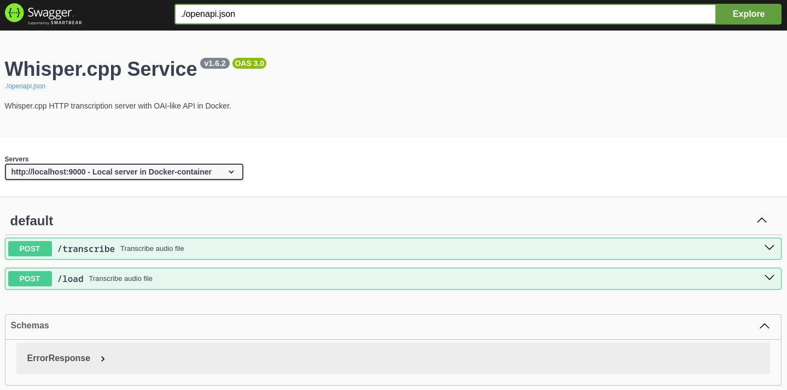

# Whisper.cpp API Webserver in Docker

Whisper.cpp HTTP transcription server with OAI-like API in Docker.

This project provides a Dockerized transcription server based
on [whisper.cpp](https://github.com/ggerganov/whisper.cpp/tree/master/examples/server).

## Features

- Dockerized whisper.cpp HTTP server for audio transcription
- Configurable via environment variables
- Automatically converts audio to WAV format
- Automatically downloads required model on startup
- Can quantize any Whisper model to the required type on startup

## Requirements

Before you begin, ensure you have a machine with an GPU that supports modern CUDA, due to the computational
demands of the docker image.

* Nvidia GPU
* CUDA
* Docker
* Docker Compose
* Nvidia Docker Runtime

For detailed instructions on how to prepare a Linux machine for running neural networks, including the installation of
CUDA, Docker, and Nvidia Docker Runtime, please refer to the
publication "[How to Prepare Linux for Running and Training Neural Networks? (+ Docker)](https://dzen.ru/a/ZVt9kRBCTCGlQqyP)"
on Russian.

## Installation

1. Clone the repo and switch to sources root:

   ```shell
   git clone https://github.com/EvilFreelancer/docker-whisper-server.git
   cd docker-whisper-server
   ```

2. Copy the provided Docker Compose template:

    ```shell
    cp docker-compose.dist.yml docker-compose.yml
    ```

3. Build the Docker image:

    ```shell
    docker-compose build
    ```

4. Start the services:

    ```shell
    docker-compose up -d
    ```

5. Navigate to http://localhost:8080 in browser:

   

## Endpoints

### /inference

Transcribe an audio file:

```shell
curl 127.0.0.1:9000/inference \
-H "Content-Type: multipart/form-data" \
-F file="@<file-path>" \
-F temperature="0.0" \
-F temperature_inc="0.2" \
-F response_format="json"
```

### /load

Load a new Whisper model:

```shell
curl 127.0.0.1:9000/load \
-H "Content-Type: multipart/form-data" \
-F model="<path-to-model-file-in-docker-container>"
```

## Environment variables

**Basic configuration**

| Name                         | Default                               | Description                                                                      |
|------------------------------|---------------------------------------|----------------------------------------------------------------------------------|
| `WHISPER_MODEL`              | base.en                               | The default Whisper model to use                                                 |
| `WHISPER_MODEL_PATH`         | /app/models/ggml-${WHISPER_MODEL}.bin | The default path to the Whisper model file                                       |
| `WHISPER_MODEL_QUANTIZATION` |                                       | Level of quantization (will be applied only if `WHISPER_MODEL_PATH` not changed) |

<details>
<summary>
<i>Advanced Configuration</i>
</summary>

| Name                      | Default    | Description                                         |
|---------------------------|------------|-----------------------------------------------------|
| `WHISPER_THREADS`         | 4          | Number of threads to use for inference              |
| `WHISPER_PROCESSORS`      | 1          | Number of processors to use for inference           |
| `WHISPER_HOST`            | 0.0.0.0    | Host IP or hostname to bind the server to           |
| `WHISPER_PORT`            | 9000       | Port number to listen on                            |
| `WHISPER_INFERENCE_PATH`  | /inference | Inference path for all requests                     |
| `WHISPER_PUBLIC_PATH`     |            | Path to the public folder                           |
| `WHISPER_REQUEST_PATH`    |            | Request path for all requests                       |
| `WHISPER_OV_E_DEVICE`     | CPU        | OpenViBE Event Device to use                        |
| `WHISPER_OFFSET_T`        | 0          | Time offset in milliseconds                         |
| `WHISPER_OFFSET_N`        | 0          | Number of seconds to offset                         |
| `WHISPER_DURATION`        | 0          | Duration of the audio file in milliseconds          |
| `WHISPER_MAX_CONTEXT`     | -1         | Maximum context size for inference                  |
| `WHISPER_MAX_LEN`         | 0          | Maximum length of output text                       |
| `WHISPER_BEST_OF`         | 2          | Best-of-N strategy for inference                    |
| `WHISPER_BEAM_SIZE`       | -1         | Beam size for search                                |
| `WHISPER_AUDIO_CTX`       | 0          | Audio context to use for inference                  |
| `WHISPER_WORD_THOLD`      | 0.01       | Word threshold for segmentation                     |
| `WHISPER_ENTROPY_THOLD`   | 2.40       | Entropy threshold for segmentation                  |
| `WHISPER_LOGPROB_THOLD`   | -1.00      | Log probability threshold for segmentation          |
| `WHISPER_LANGUAGE`        | en         | Language code to use for translation or diarization |
| `WHISPER_PROMPT`          |            | Initial prompt                                      |
| `WHISPER_DTW`             |            | Compute token-level timestamps                      |
| `WHISPER_CONVERT`         | true       | Convert audio to WAV, requires ffmpeg on the server |
| `WHISPER_SPLIT_ON_WORD`   | false      | Boolean flag to split output on words               |
| `WHISPER_DEBUG_MODE`      | false      | Enable debug mode                                   |
| `WHISPER_TRANSLATE`       | false      | Translate from source language to english           |
| `WHISPER_DIARIZE`         | false      | Stereo audio diarization                            |
| `WHISPER_TINYDIARIZE`     | false      | Enable tinydiarize (requires a tdrz model)          |
| `WHISPER_NO_FALLBACK`     | false      | Do not use temperature fallback while decoding      |
| `WHISPER_PRINT_SPECIAL`   | false      | Print special tokens                                |
| `WHISPER_PRINT_COLORS`    | false      | Print colors                                        |
| `WHISPER_PRINT_REALTIME`  | false      | Print output in realtime                            |
| `WHISPER_PRINT_PROGRESS`  | false      | Print progress                                      |
| `WHISPER_NO_TIMESTAMPS`   | false      | Do not print timestamps                             |
| `WHISPER_DETECT_LANGUAGE` | false      | Exit after automatically detecting language         |

</details>

## Links

- [whisper.cpp](https://github.com/ggerganov/whisper.cpp)
- [server example](https://github.com/ggerganov/whisper.cpp/tree/master/examples/server) of whisper.cpp
